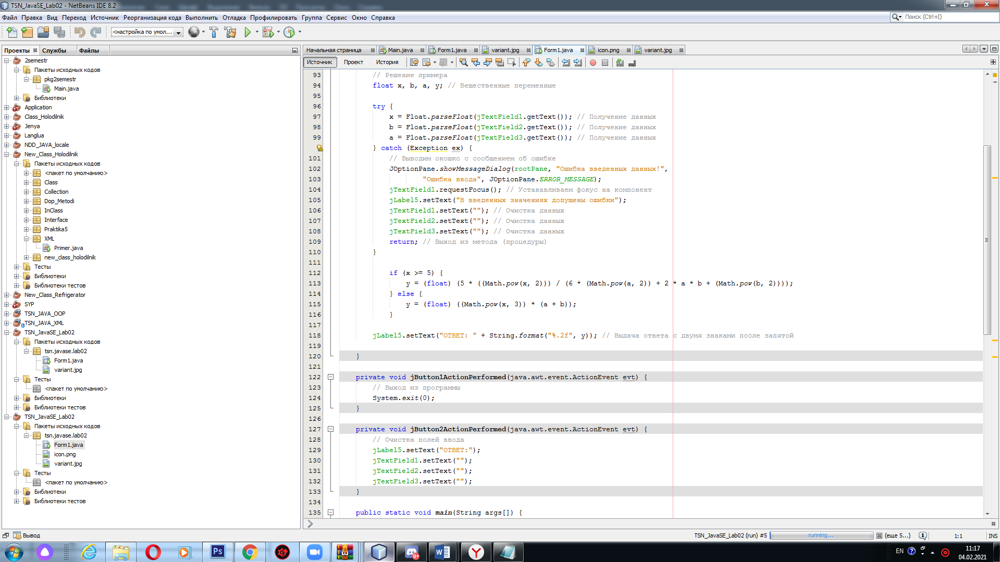
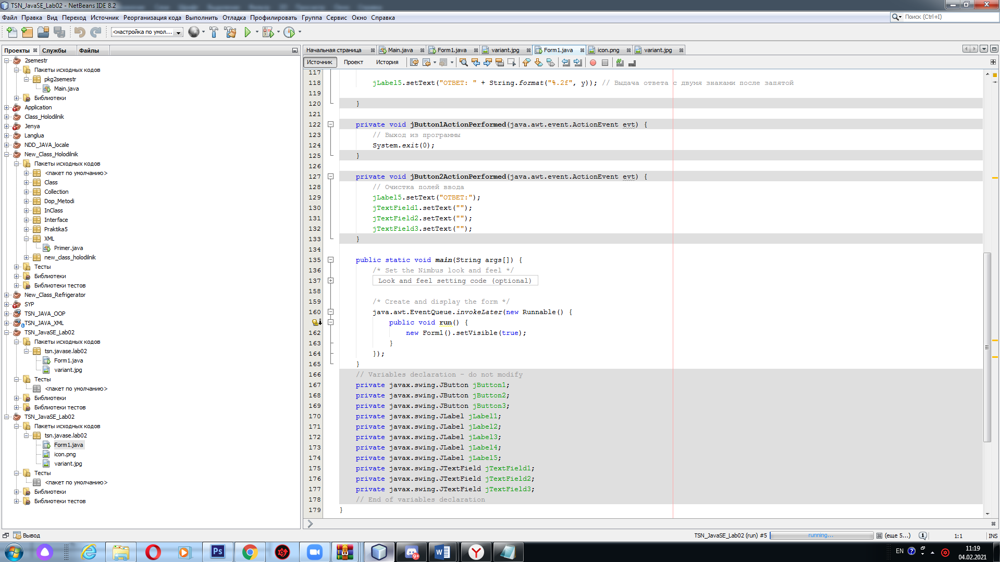
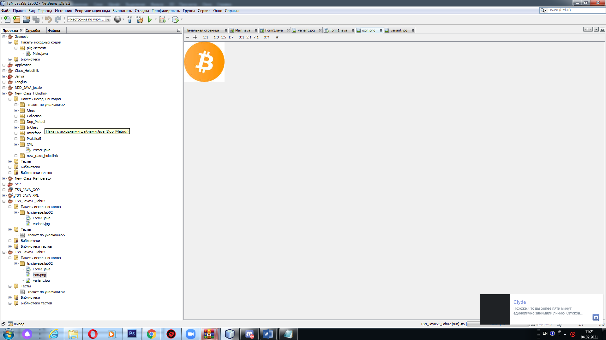
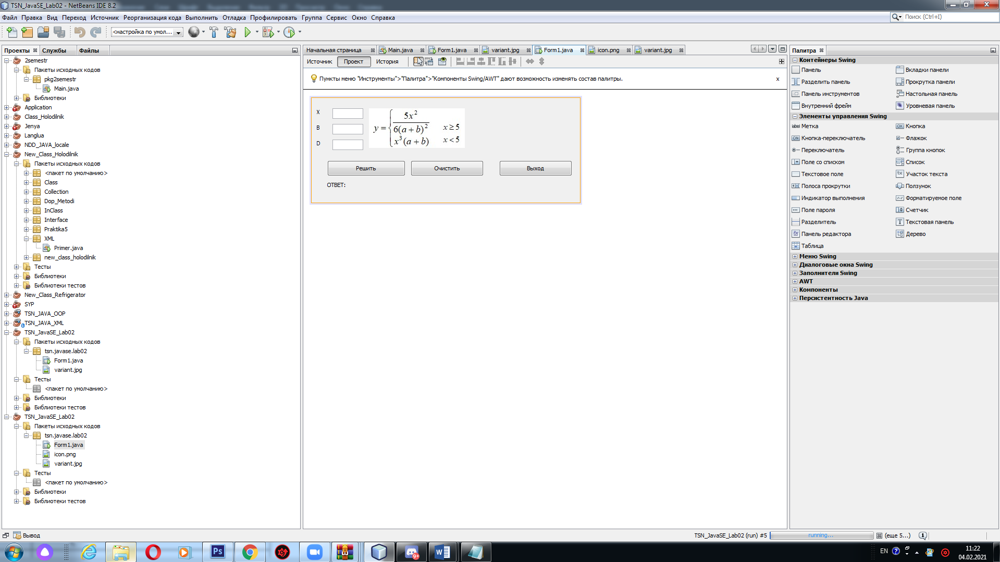
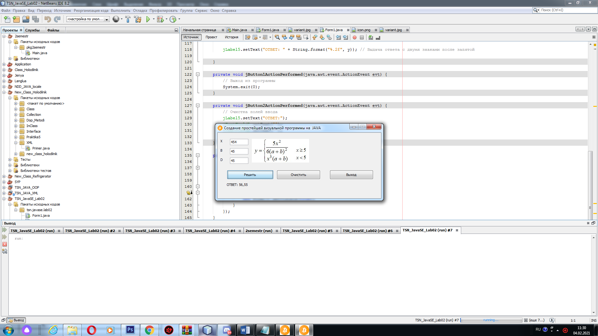

# praktika1
| Фамилия, имя студента | Группа    | Дисциплина  |Тема                              
| --------------------- |:---------:| ------------|:--------------------------------:|
| Федоренко Виталий     | ИС-302    | СВП         |2.Визуальные программы |

1. Часть. Код самой программы. 

2. Часть. Вывод программы:

